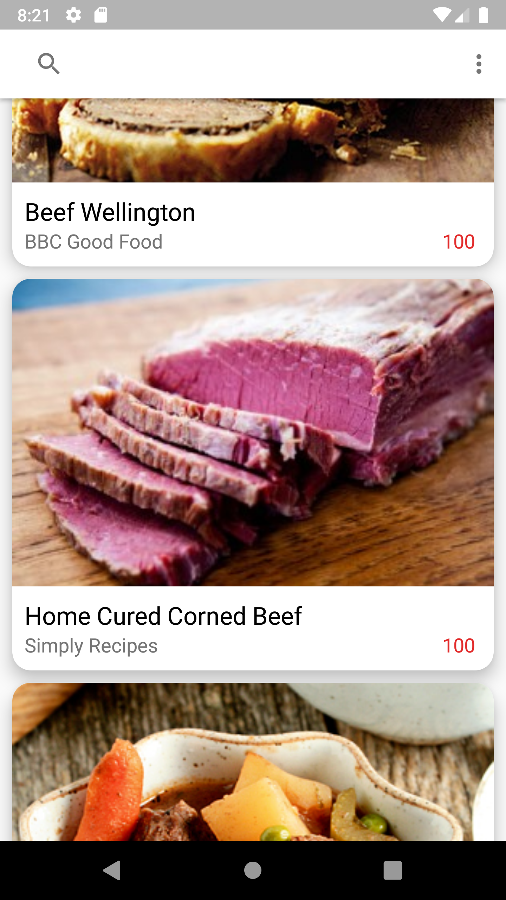

# FoodRecipes

Application de recette de cuisine. Cette application est le résultat du cursus de formation disponible dispensé par Mitch TABIAN :
- https://github.com/mitchtabian/RestApiMVVM
- https://github.com/mitchtabian/Local-db-Cache-Retrofit-REST-API-MVVM

## Concepts mis en oeuvre :
- **Part 1 : création d'une application fonctionnelle uniquement basée sur l'intérrogation d'un API REST**
  - Retrofit2 / gson (API REST  https://recipesapi.herokuapp.com/)
  - MVVM Architecture (ViewModel, Repository)
  - Singletons
  - RecyclerView
  - CardView
  - SearchView
  - Glide
  - Animation de chargement customisée
  - Utilisation de plusieurs type de vue dans le RecyclerView
  - Pagination du RecyclerView
  - Implémentation d'une Custom Toolbar
  - Customisation du comportement de la Custom Toolbar à l'aide de CoordinatorLayout et AppBarLayout
  - Observables à l'aide de LiveData, MutableLiveData et MediatorLiveData
  - Implémentation d'un menu
  - Passage d'information entre activités via les intent extras et Parcelable
  - Implémentation d'Executors pour le travail en tâche de fond
- **Part 2 : suite du développement, refactoring et implémentation du cache database**
  - Room
  - ViewModelFactory
  - Lecture du cache des données lorsque le réseau est offline
  - Definition d'une règle de rafraichissement du cache (30 jours)
  - Requêtes SQLite customisées
  - Caching des images avec Glide (Glide RecyclerView Preloader)
  - Gestion des erreurs réseaux et réseaux lents
  - Implémentation des timeouts avec un custom OkHttp3 client couplé à Retrofit2
  - Convertion des Retrofit Calls en LiveData (Call Adapters)

## Prérequis
- Android Studio
## Installation
Télécharger le .zip du projet, extraire le contenu dans le répertoire de votre choix et ouvrir ce répertoire dans Android Studio.
## Version SDK
- minSdkVersion : **21**
- targetSdkVersion : **28**
## Librairies utilisées
retrofit2
- implementation "com.squareup.retrofit2:retrofit:2.8.1"
- implementation "com.squareup.retrofit2:converter-gson:2.8.1"

okhttp3
- implementation "com.squareup.okhttp3:okhttp:4.4.0"

gson
- implementation "com.google.code.gson:gson:2.8.6"

ViewModel
- implementation "androidx.lifecycle:lifecycle-viewmodel:2.2.0"

LiveData
- implementation "androidx.lifecycle:lifecycle-livedata:2.2.0"

annotation processor
- implementation "androidx.lifecycle:lifecycle-common-java8:2.2.0"

CardView
- implementation "com.android.support:cardview-v7:28.0.0"

RecyclerView
- implementation "com.android.support:recyclerview-v7:28.0.0"

glide
- implementation "com.github.bumptech.glide:glide:4.11.0"
- annotationProcessor "com.github.bumptech.glide:compiler:4.11.0"

glide preloaders - recyclerview integration
- implementation "com.github.bumptech.glide:recyclerview-integration:4.11.0"

design support
- implementation "com.android.support:design:28.0.0"

circular ImageView
- implementation "de.hdodenhof:circleimageview:3.1.0"

Room
- implementation "androidx.room:room-runtime:2.2.5"
- annotationProcessor "androidx.room:room-compiler:2.2.5"

## Captures d'écran

